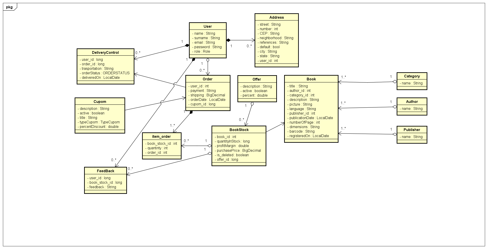

# Integrated BookStore System


## Introduction

**Project for studying Spring Boot. This project aims to apply all my current knowledge about the Java programming language and the Spring Boot framework, as well as my knowledge in API development, testing, and documentation.**

## About the Project

* This API essentially consists of the back-end of a book e-commerce system. In this sense, it has token-based validation mechanisms, two types of users (the customer and the admin), where the admin is automatically defined as the first user to be registered in the database. Additionally, it includes mechanisms for creating coupons for orders, product reviews, a creating offers for books and a delivery control.

## Some precautions before running the API:

* You must create a .env file at the root of the project with the following data in this format:

```json
HOST_DB=host
NAME_DB=database
USER_DB=user
PASSWORD_DB=password
```
## Running the API

```shell
mvn spring-boot:run
```
## Accessing the Documentation

* With the API running, access: [Api Swagger Documentation](http://localhost:8080/swagger-ui.html)

## Class Diagram


